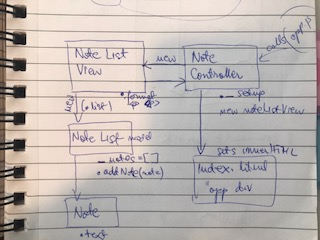

# Notes App

## Installation
$ ```npm install http-server --save-dev```

To reload page to see dev updates do a hard reload (shift + command + r)

# User Stories
As a programmer I can see a list of my notes, where each note is abbreviated to the first 20 characters, 
So I can find the one I want

As a programmer I can create a new note 
So I can record something I need to remember

As a programmer I can see the full text of an individual note on its own page 
So I can see all the information in the note

My approach

